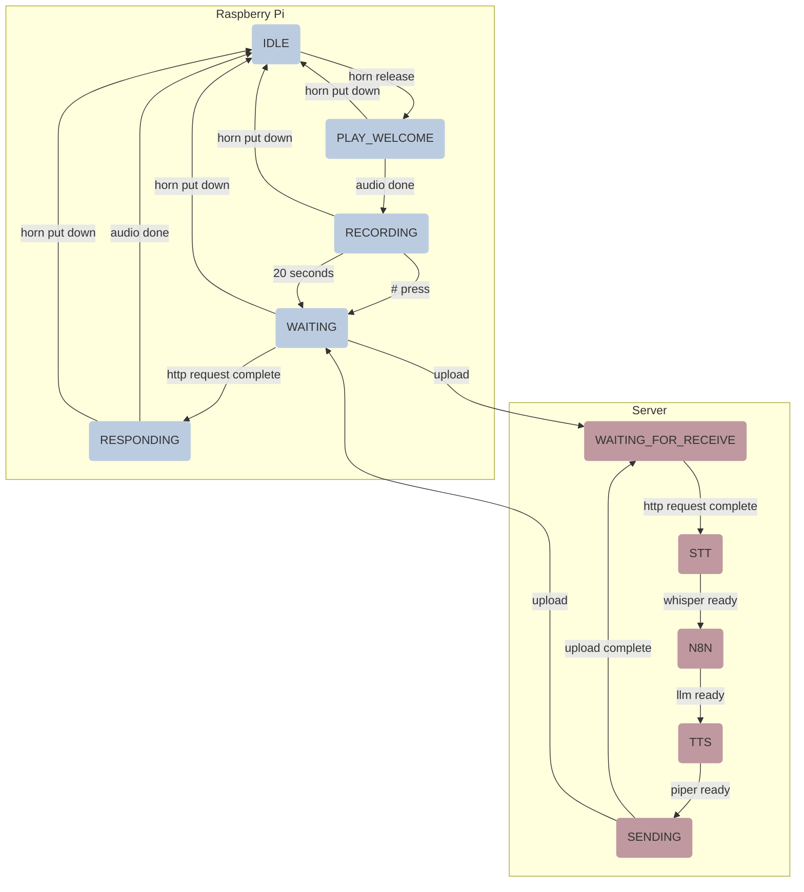

# Echoes of Tomorrow
Echoes of Tomorrow is a crazy installation developed for the [Comon](https://comon.gent/) expo at [De Krook](https://dekrook.be/).   
*Tinkered with* ❤ *by Bas Baccarne, Ben Robaeyst, Tim Theys, Fran Burger, Julien Verplanken, Yannick Christiaens, Jeroen Bourgonjon, Wanda Gaertner, Stephanie Van Hove, Azra Verlee, Axel Kiekens, Morgane Spanhove & Flo Van Hove*.
 
## Project Description
Echoes of Tomorrow is an immersive, interactive installation that invites visitors to step into a dialogue with the future. Grounded in the methodologies of Futures Research and speculative design, this experiential piece uses a powerful metaphorical and physical system to make possible futures tangible, audible, and emotionally resonant. At the heart of the installation stand four telephone boots, each representing a distinct future scenario. These futures are not predictions, but provocations—embodied visions of what could emerge based on the interplay of current social, environmental, and technological trends. Each totem channels a unique persona, brought to life through scripted AI-generated voice interactions, audio design, and environmental cues.

---

<div align="center">  
  
  
  
</div>

# Building the thing

[🕸️ General set-up](https://www.figma.com/board/wxgd1HG60FEPWjULjJxW3G/Untitled?node-id=0-1&t=mSymsbc2NLRJAKZq-1)   

📦3D model: [Fusion 360 link](https://a360.co/4aQVtJP)

🪛 Bill of materials
| part  | count  | price per part| source |
|---|---|---| ---|
| [Raspberry pi4 4GB](https://www.kiwi-electronics.com/nl/raspberry-pi-4-model-b-4gb-4268) |  4 | €80 | ✔ kiwi |
| [Power supply 27w usb-c](https://www.kiwi-electronics.com/nl/raspberry-pi-27w-usb-c-power-supply-zwart-eu-11582) | 4 | €13 | ✔ kiwi |
| [Microswitch](https://www.kiwi-electronics.com/nl/mini-microschakelaar-spdt-offset-lever-2-pack-2499)| 4 | €3 | ✔ kiwi |
| [Grove 6-position DIP switch](https://www.kiwi-electronics.com/nl/grove-6-position-dip-switch-20587?search=grove%206-position%20DIP%20switch) |4 | €5,43| ✔ kiwi |
| [Led ring](https://www.kiwi-electronics.com/nl/grove-rgb-led-ring-16-ws2813-mini-10313)| 4 | €13 | ✔ kiwi |
| Male to female jumper wires | 50 | €5 | ✔ gotron|
| SD cards 32gb (fast) | 4 | €10 | ✔ gotron |
| Router | 1 | €60 | ✔ gotron | 
| USB WiFi dongle | 1 | €10 | ✔ gotron |
| [Flat arcade button](https://www.gotron.be/componenten/schakelmateriaal/schakelaars-en-drukknoppen/arcade-knoppen/lichtgevende-arcade-drukknop-30mm-wit.html) | 4 | €3 | ✔ gotron |
| Server | 1 | -- | ✔ desktop IDE lab|
| [3.5mm jack telephone horn](https://www.amazon.com.be/-/en/Bright-Mobile-Professional-Anti-Radiation-Computers/dp/B0CP17NRHM?th=1) | 4 | €12- | ✔ amazon |
| [3.5 mm jack to usb dongle](https://www.amazon.com.be/dp/B08B1KK54P?ref=ppx_yo2ov_dt_b_fed_asin_title)|4| €9 | ✔ amazon |
| [Adafruit I2S 3W Class D Amplifier Breakout - MAX98357A](https://www.adafruit.com/product/3006?srsltid=AfmBOoqNziQHxSEdTn_SE5z7XJhqKsPX-fF9SyxldwQWQEfZMztRJJRE) | 4 |€5 | ✔ mouser |
| [3W 8Ω speaker](https://www.dfrobot.com/product-1506.html) | 4 | €3 | ✔ mouser |


#### Seting up the raspberry pi
**1. wiring**
|component|wiring|
|---|---|
| **DIP switch** | 3.3V (red), ground (black), SDA/GPIO2 (white), SCL/GPIO3 (yellow)  |
| **LED ring** | 5V (red), ground (black), data → GPIO 10 (yellow)|
| **horn button** | GPIO17 and GROUND |
| **hashtag button** | GPIO27 and GROUND |
| **I²S speaker** | LRC → GPIO19 (blue), BCLK → GPIO18 (yellow), DIN → GPIO21 (green), GND → GROUND (black), Vin → 5V (red) | 
| **USB telephone** | USB |
| **power** | USB-C |

<div align="center">  
  
</div>

* Connect the speaker to the amp
* Configure SD card (pi OS lite is fine)
* Attach power

<div align="left">  
  
</div>

**2. software**
1. Initialize Raspberry Pi & ```sudo apt update && sudo apt upgrade -y```
2. Software Installations - ```sudo apt install git i2c-tools python3-pip python3-rpi.gpio -y```
3. Get the main repo - ```git clone https://github.com/basbaccarne/echoes-of-tomorrow```
4. Install python libraries - ```pip install pyyaml requests rpi_ws281x adafruit-circuitpython-neopixel adafruit-blinka --break-system-packages``` (for pi5 you need ```Adafruit-Blinka-Raspberry-Pi5-Neopixel```)
5. Enable I²C in raspi-config
6. Configure I²S audio (see [this read me](/tests/speaker/I2S.md))
7. Allow shutdown
    ```bash
    sudo visudo
    ```
    And add this line to the end of the file
    ```
    ìni pi ALL=(ALL) NOPASSWD: /usr/sbin/shutdown 
    ```
8. Create service
    ```bash
    sudo nano /etc/systemd/system/echoes-of-tomorrow.service
    ```
    And use this content
    ```ini 
    [Unit]
    Description=Main script for Echoes of Tomorrow
    After=sound.target

    [Service]
    Type=oneshot
    User=pi
    WorkingDirectory=/home/pi/echoes-of-tomorrow/
    ExecStartPre=/bin/sh -c 'echo "\n===== START $(date) =====" >> /home/pi/log.log'
    ExecStartPre=/bin/sh -c 'echo "Checking network..." >> /home/pi/log.log && timeout 5 getent hosts github.com > /dev/null && echo "Updating repo..." >> /home/pi/log.log && timeout 15 git -C /home/pi/echoes-of-tomorrow pull >> /home/pi/log.log 2>&1 || echo "No network or git failed, skipping update." >> /home/pi/log.log'
    ExecStart=/usr/bin/python3 /home/pi/echoes-of-tomorrow/src/main.py
    RemainAfterExit=no
    StandardOutput=append:/home/pi/log.log
    StandardError=append:/home/pi/log.log
    Restart=no
    RestartSec=5
    TimeoutStartSec=300
    Environment=PYTHONUNBUFFERED=1

    [Install]
    WantedBy=multi-user.target
    ```
    Then enable this service
    ```bash
    sudo systemctl daemon-reload
    sudo systemctl enable echoes-of-tomorrow.service
    sudo systemctl start echoes-of-tomorrow.service
    ```
9. Add shutdown logic [to do]
10. Switch to offline network comon [to do]


#### Seting up the server
1. On a fresh Ubuntu server: ```sudo apt update && sudo apt upgrade -y```
2. Software Installations - ```sudo apt install git nodejs npm -y```
3. Get the main repo - ```git clone https://github.com/basbaccarne/echoes-of-tomorrow```
4. Install n8n (issue: n8n requires a specific version of nodejs > check this)
5. Install ollama

#### State machine (pi & server)


```mermaid
flowchart TB
    classDef pi     fill:#BCCCE0,stroke-width:0
    classDef server fill:#BF98A0,stroke-width:0

    %% --- Explicit rounded node declarations ---
    IDLE(IDLE):::pi
    PLAY_WELCOME(PLAY_WELCOME):::pi
    RECORDING(RECORDING):::pi
    WAITING(WAITING):::pi
    RESPONDING(RESPONDING):::pi

    WAITING_FOR_RECEIVE(WAITING_FOR_RECEIVE):::server
    STT(STT):::server
    N8N(N8N):::server
    TTS(TTS):::server
    SENDING(SENDING):::server

    subgraph Pi ["Raspberry Pi"]
        direction TB
        IDLE -->|horn release| PLAY_WELCOME
        PLAY_WELCOME -->|audio done| RECORDING
        PLAY_WELCOME -->|horn put down| IDLE
        RECORDING -->|# press| WAITING
        RECORDING -->|20 seconds| WAITING
        RECORDING -->|horn put down| IDLE
        WAITING -->|http request complete| RESPONDING
        WAITING -->|horn put down| IDLE
        RESPONDING -->|audio done| IDLE
        RESPONDING -->|horn put down| IDLE
    end

    subgraph Srv ["Server"]
        direction TB
        WAITING_FOR_RECEIVE -->|http request complete| STT
        STT -->|whisper ready| N8N
        N8N -->|llm ready| TTS
        TTS -->|piper ready| SENDING
        SENDING -->|upload complete| WAITING_FOR_RECEIVE
    end

    WAITING -->|upload| WAITING_FOR_RECEIVE
    SENDING -->|upload| WAITING

```

#### led ring animations
* **idle**: slow amber breathe, very dim. The booth feels alive but dormant, like embers.
* **play_welcome**: a gold comet chases around the ring. Looping and directional, it creates a sense of something arriving.
* **recording**: all 16 LEDs glow red at the start, then drain away one by one over exactly 20 seconds. No numbers needed — the user can feel the time running out.
* **waiting**: an orange spinner with a fading trail. Continuous loop, unhurried, something is happening behind the scenes.
* **response**: soft cream pulse. Gentle and warm, like candlelight, so it doesn't compete with the audio playback.

# File structure for dynamic files on the server
```
/home/
  /io/
    echoes-of-tomorrow/
        audio_files/
            question_0.wav
            question_0.txt
            reponse_0.txt
            response_0.wav

            question_1.wav
            question_1.txt
            reponse_1.txt
            response_1.wav

            question_2.wav
            question_2.txt
            reponse_2.txt
            response_2.wav

            question_3.wav
            question_3.txt
            reponse_3.txt
            response_3.wav
```

# Background: logging
To log the output of the main.py script, you can use the following command. This will save the logs to a file named `echo_log.txt` in your home directory while also displaying them in the terminal.
```bash
sudo python -u echoes-of-tomorrow/src/main.py 2>&1 | tee ~/echo_log.txt
```


# Background: booting
To enable the pi to boot at startup, you have to create a service. In this case, we give the service the name **echo**.
```bash
sudo nano /etc/systemd/system/echo.service
```
And use this content
```ini
[Unit]
Description=Echoes of Tomorrow
After=multi-user.target sound.target network.target

[Service]
User=pi
WorkingDirectory=/home/pi/echoes-of-tomorrow/src
ExecStart=/usr/bin/python3 /home/pi/echoes-of-tomorrow/src/main.py
Restart=always
RestartSec=5
Environment=PYTHONUNBUFFERED=1
StandardOutput=journal
StandardError=journal

[Install]
WantedBy=multi-user.target
```
Then enable this service
```bash
sudo systemctl daemon-reload
sudo systemctl enable echo.service
sudo systemctl start echo.service
```

# Tests
## Capture microphone input (mic)
**Hardware**
* ❌ Test: [Element 14 Wolfson Audio Card](/tests/mic/wolfson.md) (old raspis)
* ❌ Test: [Respeaker 2](/tests/mic/respeaker.md) (depricated old raspis)
* ❌ Test: USB microphone  (aborted, the other solutions are good enough and smaller)
* ✔️ Test: [Google Voice HAT](/tests/mic/voice_hat.md) (with button and speaker)
* ✔️ Test: [USB sound card](/tests/mic/usb%20_sound_card.md)
* ✔️ Test: [I²S microphone](/tests/mic/I2S.md) (e.g. INMP441)

**Software**
* ✔️ Test: [python audio capture](/tests/mic/python_record.py)

## Speech to text (STT)
* ✔️ Test: [faster-whisper](/tests/STT/readme.md)

## Integration layer
* ✔️ Test: [n8n](/tests/integration/readme.md)
* ✔️ Test: [sending webhook data to n8n](/tests/webhook/)

## Interpretation (LLM)
* ✔️ Test: [Ollama](/tests/LLM/readme.md) - local but slowish
* ✔️ Test: [ChocoLlama](/tests/LLM/readme.md) - local, Flemish, bit realy slow
* ✔️ Test: [OpenAI API](/tests/LLM/readme.md) - quick, but cloud-based & maga-support
* ✔️ Test: RAG system

## Text to speech (TTS)
* ✔️ test: [piper](/tests/TTS/readme.md)
* ✔️ test: [Hume AI](/tests/TTS/readme.md)
* ✔️ test: [Edge TTS](/tests/TTS/readme.md)

## Send audio (speaker)
* ❌ Test: Respeaker 2 (depricated old raspis)
* ❌ Test: USB speaker (aborted, the other solutions are good enough and smaller)   
* ✔️ Test: [USB sound card](/tests/speaker/usb_sound_card.md)
* ✔️ Test: [Google Voice HAT](/tests/speaker/voice_hat.md)
* ✔️ Test: [I²S DAC pre-amp](/tests/speaker/I2S.md) (e.g. ADA3006)

## General remarks
**Latency challenge**
* Nvidia Jetson Orin Nano could make things quicker on the pi

**Other things to think of**
* Avoid long responses
* [Interesting read](https://medium.com/@martin.hodges/setting-up-a-mems-i2s-microphone-on-a-raspberry-pi-306248961043)   

**Discarded but interesting components**
| part  | count  | price per part| source |
|---|---|---| ---|
| [optional: Grove pi HAT](https://www.kiwi-electronics.com/nl/grove-base-hat-for-raspberry-pi-3930) | 4 | €10 | ✔ kiwi |
| [optional: Grove to female jumper](https://www.kiwi-electronics.com/nl/grove-4-pin-female-jumper-to-grove-4-pin-conversion-cable-5-pack-2065) | 4 | €4.10 | ✔ kiwi |