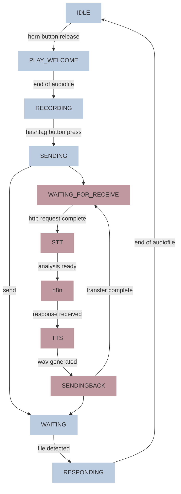

# Echoes of Tomorrow
Echoes of Tomorrow is an installation developed for the [Comon](https://comon.gent/) expo at [De Krook](https://dekrook.be/).   
*Tinkered with* ❤ *by Bas Baccarne, Ben Robaeyst, Tim Theys, Fran Burger, Julien Verplanken, Yannick Christiaens, Jeroen Bourgonjon, Wanda Gaertner, Stephanie Van Hove, Azra Verlee, Axel Kiekens, Morgane Spanhove & Flo Van Hove*.
 
## Project Description
Echoes of Tomorrow is an immersive, interactive installation that invites visitors to step into a dialogue with the future—literally. Grounded in the methodologies of Futures Research and speculative design, this experiential piece uses a powerful metaphorical and physical system to make possible futures tangible, audible, and emotionally resonant. At the heart of the installation stand four telephone boots, each representing a distinct future scenario. These futures are not predictions, but provocations—embodied visions of what could emerge based on the interplay of current social, environmental, and technological trends. Each totem channels a unique persona, brought to life through scripted AI-generated voice interactions, audio design, and environmental cues.

---

# Hack zone

* [General set-up](https://www.figma.com/board/wxgd1HG60FEPWjULjJxW3G/Untitled?node-id=0-1&t=mSymsbc2NLRJAKZq-1)

# Bill of materials
| part  | count  | price per part|
|---|---|---|
| raspberry pi 4B |  4 | €80 |
| voeding raspi | 4 | €13 |
| SD kaartje SANDISK MicroSDXC Ultra 32gb | 4 | €10 |
| Microswitch eindstop | 4 | €3 |
| Flat arcade button | 4 | €1,5 |
| led ring | 4 | €20 |
| router | 1 | €60 |
| USB WiFi dongle server | 1 | €10 |
| server | 1 | laptop dennis|
| USB or 3.5mm jack telephone horn |4| €20 |
| (if 3.5 mm) jack to usb dongle|4| €9 |
| [Grove 6-position DIP switch](https://www.kiwi-electronics.com/nl/grove-6-position-dip-switch-20587?search=grove%206-position%20DIP%20switch) |4 | €5,43|

# 3D model
* [Fusion link](https://a360.co/4aQVtJP)

---
# Build zone pi
**wiring**
* Connect horn button to ``GPIO4`` and ``GROUND``
* Connect hashtag button to ``GPIO3`` and ``GROUND``
* Connect USB telephone to USB
* Attach power
* Configure SD card (pi OS lite is fine)

**software**
1. Initialize Raspberry Pi & ```sudo apt update && sudo apt upgrade -y```
2. Software Installations - ```sudo apt install git -y```
3. Get the main repo - ```git clone https://github.com/basbaccarne/echoes-of-tomorrow```
4. Install python libraries - ```pip install pyyaml```
5. Set ID
6. Set service
7. Switch to offline network comon


# Build zone server
1. Get the main repo - ```git clone https://github.com/basbaccarne/echoes-of-tomorrow```

# State machine (pi & server)



# Tests
## Capture microphone input (mic)

**Hardware**
* ❌ Test: [Element 14 Wolfson Audio Card](/tests/mic/wolfson.md) (old raspis)
* ❌ Test: [Respeaker 2](/tests/mic/respeaker.md) (depricated old raspis)
* ❌ Test: USB microphone  (aborted, the other solutions are good enough and smaller)
* ✔️ Test: [Google Voice HAT](/tests/mic/voice_hat.md) (with button and speaker)
* ✔️ Test: [USB sound card](/tests/mic/usb%20_sound_card.md)
* ✔️ Test: [I²S microphone](/tests/mic/I2S.md) (e.g. INMP441)

**Software**
* ✔️ Test: [python audio capture](/tests/mic/python_record.py)

## Speech to text (STT)
* ✔️ Test: [faster-whisper](/tests/STT/readme.md)

## Integration layer
* ✍🏻 Test: [n8n](/tests/integration/readme.md)

## Interpretation (LLM)
* ✔️ Test: [Ollama](/tests/LLM/readme.md) - local but slowish
* ✔️ Test: [ChocoLlama](/tests/LLM/readme.md) - local, Flemish, bit realy slow
* ✔️ Test: [OpenAI API](/tests/LLM/readme.md) - quick, but cloud-based & maga-support
* 💬 Test: RAG system

## Text to speech (TTS)
* ✔️ test: [piper](/tests/TTS/readme.md)
* ✔️ test: [Hume AI](/tests/TTS/readme.md)
* ✔️ test: [Edge TTS](/tests/TTS/readme.md)

## Send audio (speaker)
* ❌ Test: Respeaker 2 (depricated old raspis)
* ❌ Test: USB speaker (aborted, the other solutions are good enough and smaller)   
* ✔️ Test: [USB sound card](/tests/speaker/usb_sound_card.md)
* ✔️ Test: [Google Voice HAT](/tests/speaker/voice_hat.md)
* ✔️ Test: [I²S DAC pre-amp](/tests/speaker/I2S.md) (e.g. ADA3006)

## General remarks
**Latency challenge**
* Nvidia Jetson Orin Nano kan dit sneller maken (, maar duur > €500)
* Een lokale server kan dit sneller maken
* Een cloud serverice kan dit sneller maken

**Other things to think of**
* Dutch plosives (“p”, “t”, “k”) clip easily → lower mic gain
* Avoid long responses
* [Interesting read](https://medium.com/@martin.hodges/setting-up-a-mems-i2s-microphone-on-a-raspberry-pi-306248961043)   