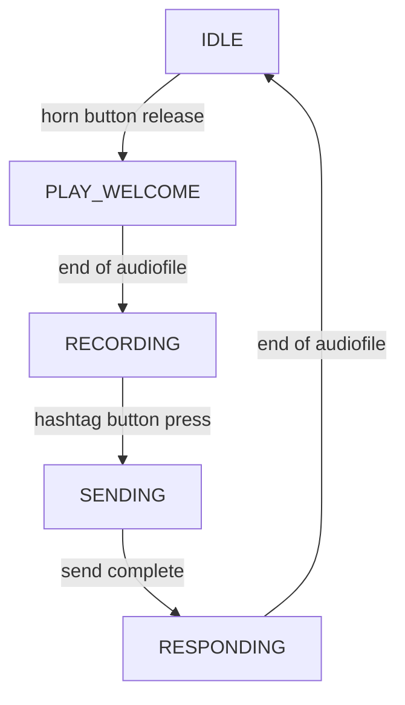

**Logical path Pi side**

**Installation instructions and build**   

*Raspi - wiring*
* Connect horn button to ``GPIO4`` and ``GROUND``
* Cònnect hashtag button to ``GPIO3`` and ``GROUND``
* Connect USB telephone to USB
* Attach power
* Configure SD card

*Raspi - code*
* Update & upgrade
* Git clone
* Dependencies:
* Switch to offline network comon
* Set ID
* Set service
