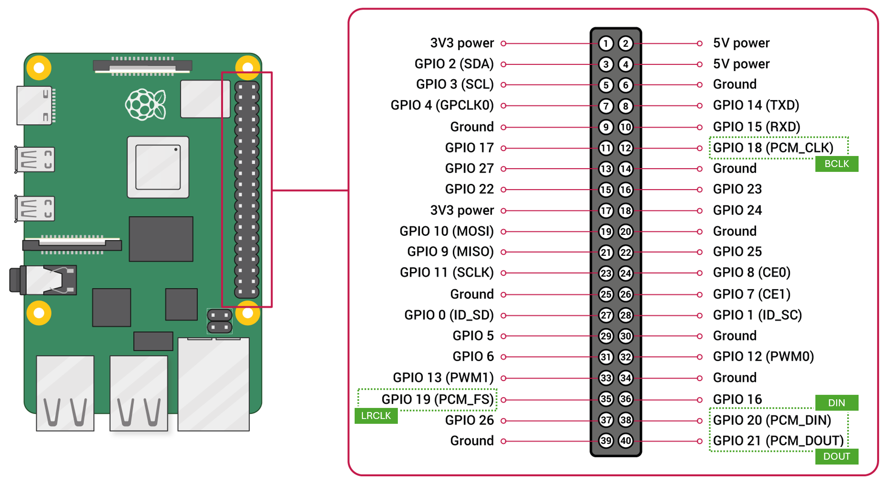

# Record audio using an I²S MEMS microphone
## Hardware
**Components**
* Hardware: [INMP441 MEMS I2S](https://www.tinytronics.nl/en/sensors/sound/inmp441-mems-microphone-i2s)
* Specs:
    * 24-bit I²S
    * VCC takes 1.8-3.3V
    * L/R pin allows configuration of channel allocation at a high or low level

**A little knowledge**
* MEMS = a tiny silicon diaphragm.
* This allows miniaturisation on a small PCB, that includes a MEMS acoustic sensor, a preamp, an ADC, and a I²S formatter. All on one 1cmx1cm board.

**The I²S protocol** (don't confuse with I2C)
I²S (Inter-IC Sound) is a digital audio bus designed to move **raw audio data** between chips (pure digital PCM samples (the actual waveform values)).

* A DAC (amp) transforms converts digital I²S PCM data to them to analog voltage.
* An ADC (mic) transforms an analog voltage to an I²S digital PCM signal.

🧠 Your microcontroller/SBC must have I²S on board. 
Raspi has this & can be the I²S master (AND routes this to ALSA, very handy).


**The pins and connections**
Basic I²S pin usage
|pin | description  |
|:------|:------|
| ```BCLK``` |  Bit Clock (soemtimes ```SCK```), ticks once per audio bit - the metronome|
| ```LRCLK``` | Sometimes Word Select (```WS```) or just ```LRC```, switches between left (low-to GND) & right (high- to VDD) for stereo aduio |
| ```DATA``` | Or ```DIN``` or ```SD```. Carries the actual audio bits (waveform)

The INMP441 has these extra pins
|pin | description  |
|:------|:------|
| ```L/R``` |  set to high or low to identify as a left or right mic|
| ```SD``` | Serial Data - The actual data DOUT |
| ```GND``` | ground pin|
| ```VDD```| ⚠️ 1.8-3.3V|

On Raspberry Pi
|pin | description  |
|:------|:------|
| ```BCLK``` |  GPIO18 (shared with all I²S devices)|
| ```LRCLK``` | GPIO19  (shared with all I²S devices)|
| ```DATA IN``` | GPIO20 |
| ```DATA OUT``` | GPIO21 |

<div align="left">  
  
</div>

**Sharing the I²S connection with mic and a speaker**   

I²S is designed for:
* One DATA OUT (to DAC)
* One DATA IN (from ADC/mic)
* ⚠️ **Shared BCLK & LRCLK**


## Software
**Configuration using google config**

1. I²S must be enabled on raspi, so check
    ```bash
    sudo nano /boot/firmware/config.txt
    ```
    Check or add (reboot if you changed something)
    ```ini
    # this has a lot of things preconfigured
    dtoverlay=googlevoicehat-soundcard
    ```
2. Check if the device is visible
    ```bash
    arecord -l
    ```
    Sould show something in the list like (device detected card ID 2, device 0)
    ```ini
   card 2: sndrpigooglevoi [snd_rpi_googlevoicehat_soundcar], 
   device 0: Google voiceHAT SoundCard HiFi voicehat-hifi-0 [Google voiceHAT SoundCard HiFi voicehat-hifi-0]
    ```

**Test**
Record a 5 second snipper & play it (check device IDs)
```bash
arecord -D plughw:2,0 -f cd -d 5 test.wav
aplay -D plughw:3,0 test.wav
```

**Python test**
```python
pip install sounddevice
```
```python
import sounddevice as sd
import soundfile as sf

duration = 5
fs = 48000

recording = sd.rec(int(duration * fs), samplerate=fs, channels=1)
sd.wait()

sf.write("mic_test.wav", recording, fs)
```