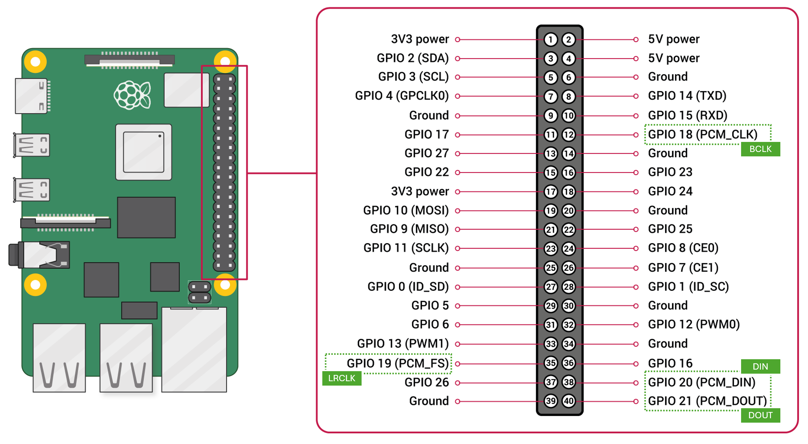

# Play audio using a I²S 3W Class D Amplifier
## Hardware
**Components**
* Hardware: [Adafruit I2S 3W Class D Amplifier Breakout - MAX98357A](https://www.adafruit.com/product/3006?srsltid=AfmBOoqNziQHxSEdTn_SE5z7XJhqKsPX-fF9SyxldwQWQEfZMztRJJRE). This is (1) an I²C DAC + (2) an ampifier combined on one board (class D = an efficient ampflifier).
* A small speaker (4-8Ω, 3W), connected to the blue terminal connector (e.g. [3W 8Ω](https://www.dfrobot.com/product-1506.html))

**The I²S protocol** (don't confuse with I2C)
I²S (Inter-IC Sound) is a digital audio bus designed to move **raw audio data** between chips (pure digital PCM samples (the actual waveform values)).

* A DAC (amp) transforms converts digital I²S PCM data to them to analog voltage.
* an ADC (mic) transforms an analog voltage to an I²S digital PCM signal.

🧠 Your microcontroller/SBC must have I²S on board. 
Raspi has this & can be the I²S master (AND routes this to ALSA, very handy).


**The pins and connections**
Basic I²S pin usage
|pin | description  |
|:------|:------|
| ```BCLK``` |  Bit Clock, ticks once per audio bit - the metronome|
| ```LRCLK``` | Sometimes Word Select (```WS```) or just ```LRC```, switches between left & right for stereo aduio |
| ```DATA``` | Or ```DIN```. Carries the actual audio bits (waveform)

The MAX98357A has these extra pins
|pin | description  |
|:------|:------|
| ```GAIN``` |  to set the gain (optional, can be physical)|
| ```SD``` | Serial Data - shutdown or mode switching mono/left/right (default: mix to mono) |
| ```GND``` | groundpin|
| ```Vin```| Connect to 3.3V or 5V (prefer 5V)|

On Raspberry Pi
|pin | description  |
|:------|:------|
| ```BCLK``` |  GPIO18 (shared with all I²S devices)|
| ```LRCLK``` | GPIO19  (shared with all I²S devices)|
| ```DATA IN``` | GPIO20 |
| ```DATA OUT``` | GPIO21 |

<div align="left">  
  
</div>

**Amp ~ speaker match**
* The MAX98357A delivers 1.8W @ 8Ω @ 5V.
* My speaker is 3W 8Ω
* It won't blow the speaker but will not produce max decibels.

## Software

1. I²S must be enabled on raspi, so check
    ```bash
    sudo nano /boot/firmware/config.txt
    ```
    Check or add (reboot if you changed something)
    ```ini
    # CHANGE this:
    dtparam=audio=on
    # TO:
    dtparam=audio=off
    #In the [all] section at the bottom, ensure it reads:
    [all]
    enable_uart=1
    dtparam=audio=off
    dtparam=i2s=on
    dtparam=spi=on
    dtoverlay=max98357a
    ```
2. Check if the device is visible
    ```bash
    aplay -l
    ```
    Sould show something in the list like 
    ```ini
   card 2: sndrpihifiberry [snd_rpi_hifiberry_dac], 
   device 0: HifiBerry DAC HiFi pcm5102a-hifi-0 [HifiBerry DAC HiFi pcm5102a-hifi-0]
    ```   
3. Play a sample file (change ```2,0``` to the correct ALSA ID) using:
    ```bash
    aplay -D plughw:2,0 /usr/share/sounds/alsa/Front_Center.wav
    ```
4. Create asound file
```
sudo nano /etc/asound.conf
```
and add this
```ini
# USB as default output
pcm.!default {
    type plug
    slave.pcm "hw:CARD=Audio,DEV=0"
}

ctl.!default {
    type hw
    card Audio
}

# dmix holds I2S clocks alive to prevent pop
pcm.dmix_i2s {
    type dmix
    ipc_key 2048
    ipc_perm 0666
    slave {
        pcm "hw:CARD=MAX98357A,DEV=0"
        period_size 1024
        buffer_size 8192
        rate 44100
        channels 1
        format S16_LE
    }
}

pcm.i2s_amp {
    type plug
    slave.pcm "dmix_i2s"
}
```
